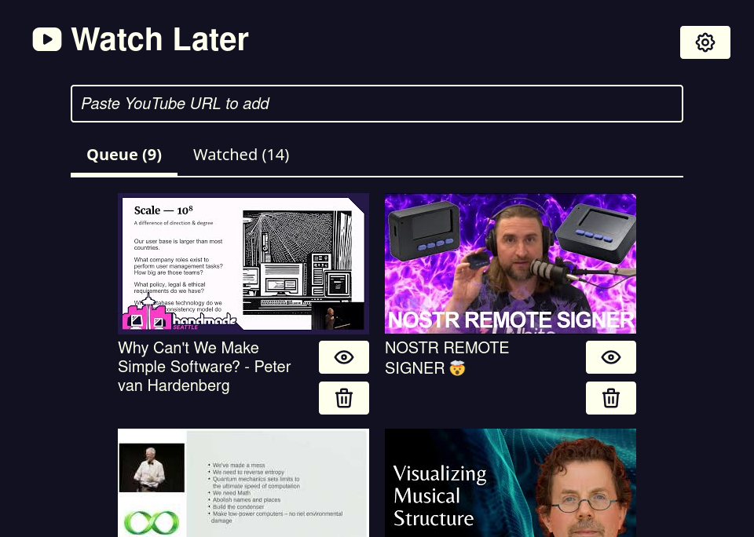

# Watch Later

Simple YouTube watch list app that syncs across devices using the Nostr network. No YouTube login required.

Open `index.html` in your browser to use it, or visit the live version at [mccormick.cx/apps/watch-later](https://mccormick.cx/apps/watch-later).

[Download a zip containing the web app](https://github.com/chr15m/watch-later/archive/refs/heads/main.zip) to self-host.

[Features](#features) | [Usage](#usage) | [Self-Hosting](#self-hosting) | [How It Works](#how-it-works) | [Technology](#technology) | [License](#license)

## Features

- **YouTube Integration**: Paste YouTube URLs to add videos to your watch list
- **Cross-device Sync**: Your watch list syncs across all devices using Nostr relays
- **Playback Tracking**: Resume videos where you left off
- **Privacy First**: All data is encrypted with your private key
- **Offline Capable**: Works as a Progressive Web App (PWA)
- **No Account Required**: Uses cryptographic keys instead of traditional accounts

## Usage

- Paste a YouTube URL in the input field to add videos
- Click video thumbnails to watch with playback position tracking
- Toggle between "Queue" (unwatched) and "Watched" tabs
- Mark videos as watched/unwatched with the eye icon
- Access settings to manage Nostr relays and backup your key
- Your nsec key can be copied to sync with other devices

## Self-Hosting

Watch Later is a static web application that can be hosted on any web server or static hosting provider (like GitHub Pages, Netlify, or Vercel). No backend or build process is required.

Simply upload [the project files](https://github.com/chr15m/watch-later/archive/refs/heads/main.zip) to your web hosting service and access the `index.html` file.

## How It Works

Watch Later uses the [Nostr protocol](https://en.wikipedia.org/wiki/Nostr) to store your encrypted watch list on decentralized relays.
Your data is encrypted with your private key (nsec), ensuring only you can access it.
The app automatically syncs changes across all your devices without requiring any central server or account.

## Technology

- [Scittle ClojureScript](https://github.com/babashka/scittle/)
- [Reagent](https://reagent-project.github.io/) for React-style UI
- [Nostr Tools](https://github.com/nbd-wtf/nostr-tools) for decentralized sync
- [YouTube Player API](https://developers.google.com/youtube/iframe_api_reference) for video playback
- [Promesa](https://github.com/funcool/promesa) for async operations

## License

MIT
